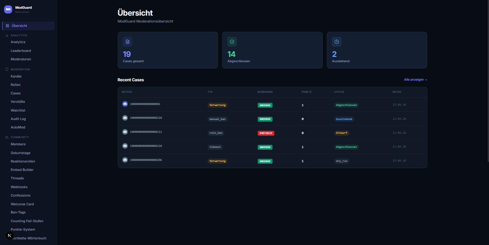
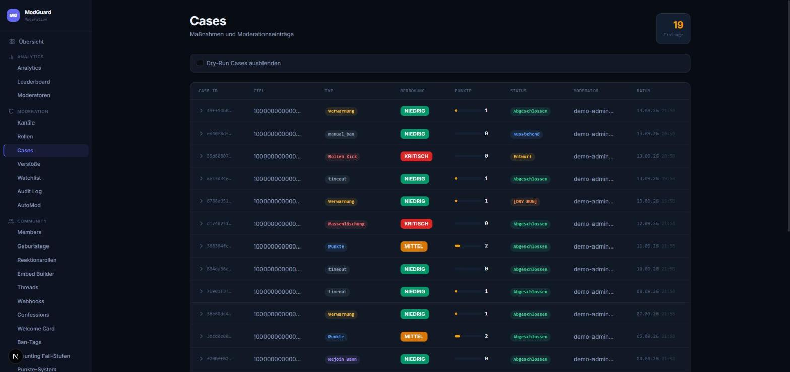
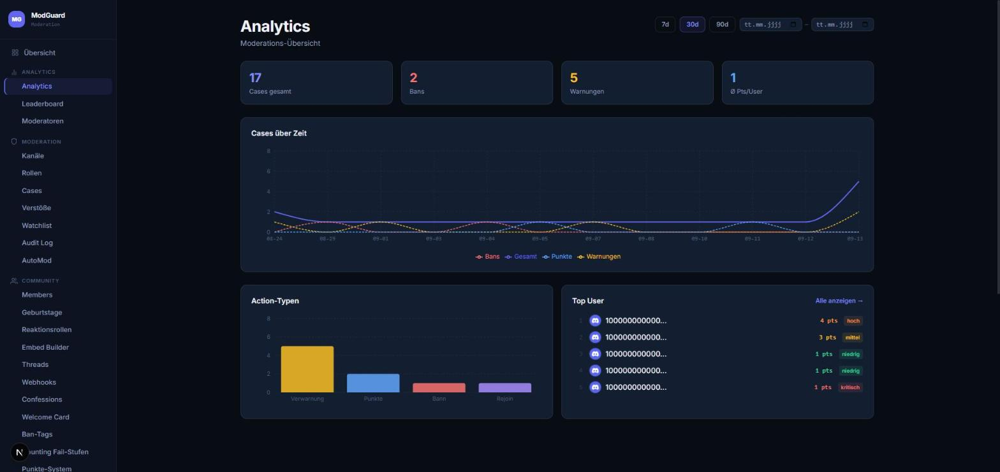
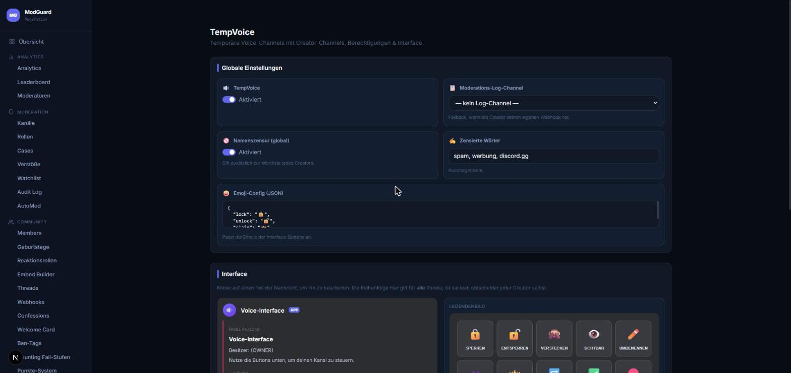

# ModGuard Dashboard

Das ist das Web-Dashboard für einen Discord-Moderations-Bot: Cases, Audit-Log, Mitglieder-Analytics, TempVoice, AutoMod und noch einiges mehr.

**Preview:** [dashboard.quitscope.eu](https://dashboard.quitscope.eu/)

Hier siehst du nur das Frontend, und zwar mit Fake-Daten. Der echte Bot mit seinem Backend (NestJS + Postgres) liegt in einem privaten Repo, das hier ist eine abgespeckte Version, mit der ich einfach nur das UI zeigen will. Der Login ist ein One-Click-Demo-Zugang, kein richtiges Discord-OAuth, und es geht nie eine Anfrage raus an die Discord-API oder sonst einen echten Server.

## Screenshots

**Overview**



**Cases**



**Analytics**



**TempVoice**



## Features

- **Moderation**: Cases (Warnungen, Punkte, Bans, Timeouts, Rejoin-Bans, Role-Bans, Massenlöschung von Nachrichten, ...), Violations, Watchlist, Audit-Log, AutoMod
- **Analytics**: Case-Volumen über Zeit, Aufschlüsselung nach Aktionstyp, Leaderboard, Moderator-Statistiken
- **Server-Verwaltung**: Channels, Rollen, Mitglieder, Threads
- **Community**: TempVoice, Wortkette, Confessions, Reaction Roles, Embed-Builder, Webhooks, Welcome Cards, Geburtstage, Ban-Tags

## Stack

- Next.js 16 (App Router), React 19, TypeScript
- next-auth 5 (Auth.js), Demo-Credentials-Login mit JWT-Sessions
- Tailwind CSS 4
- Ein Mock-Store (`src/lib/mock-store.ts` und Verwandte) statt dem echten NestJS-API/Postgres-Backend und der Discord-Bot-Anbindung

## Lokal starten

```bash
pnpm install
cp .env.example .env.local   # NEXTAUTH_SECRET eintragen
pnpm dev
```

Dann http://localhost:3000 öffnen und auf "Demo-Login starten" klicken.

## Hinweise

- Die Mock-Daten setzen sich bei jedem Server-Neustart zurück.
- Keine Verbindung zu einem echten Discord-Server, einer Datenbank oder der Discord-API.
